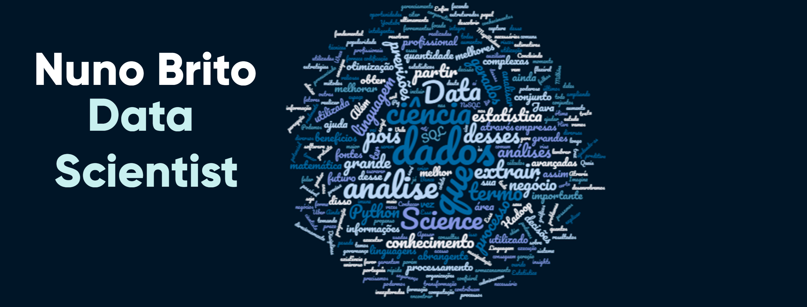

   

  

# Nuno Brito
**Data Scientist**

Apaixonado por tecnologia, e caminho de uma grande jornada de aprendizado para ser um melhor Data Scientist.

**Background in:** Python, Data Storytelling

**Links:**
* [LinkedIn](https://www.linkedin.com/in/nunobriito/)
* [Medium](https://medium.com/@nuno.almeida.221991)
* [Twitter]()

## Projetos:
Incoming....

